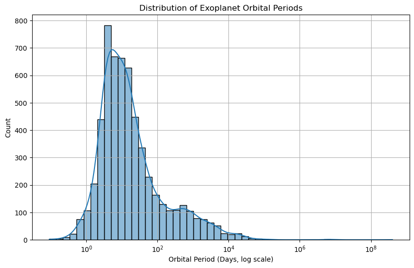
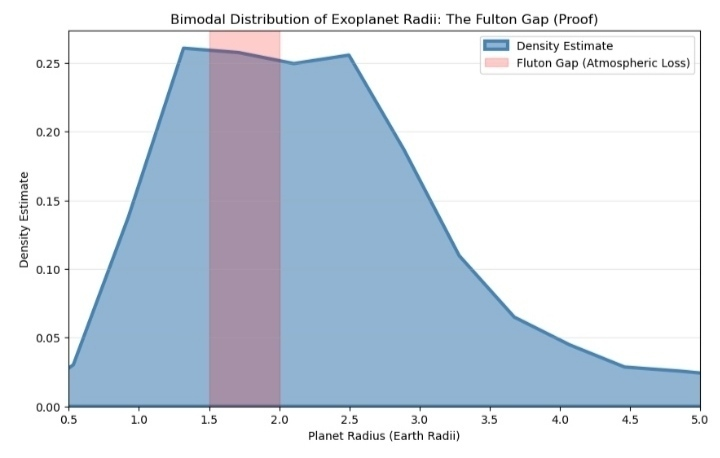
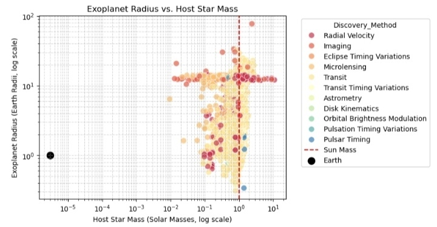

<div align="center">
  
  <br><br>
  <h1>🌌 The Exoplanet Census: Fulton Gap & Observational Bias</h1>
  
  <p><i>Independent analysis of 6,000+ NASA exoplanets revealing photoevaporation's role in the <b>1.5–2.0 R⊕ gap</b>.</i></p>
</div>

[](https://github.com/Rohan735-cool/Exoplanet-Research-NASA)
[](https://github.com/Rohan735-cool/Exoplanet-Research-NASA)
[](https://python.org)


# The Exoplanet Census: Observational Bias and the Radius Gap

> An independent data analysis project exploring the bimodal distribution of exoplanet radii using the NASA Exoplanet Archive.

---

## Overview

This project investigates the **Fulton Gap** — a statistically significant dip in the frequency of planets with radii between **1.5 and 2.0 Earth radii** — using a dataset of approximately 6,000 confirmed exoplanets. The analysis explores how photoevaporation drives atmospheric loss in sub-Neptune-sized planets, causing them to shrink into bare rocky cores (super-Earths), and examines how observational bias across different discovery methods shapes our understanding of planetary populations.

**Key Finding:** The bimodal radius distribution is consistent with photoevaporation theory — smaller planets near their host stars cannot retain their hydrogen/helium envelopes under intense stellar XUV radiation, producing the observable gap in the size distribution.

---

## Language & Tools


---

## 📋 Contents
- [🎯 Key Findings](#-key-findings)
- [🛠️ Quick Start](#️-quick-start)
- [📊 Results](#-results)
- [🔭 Live Demo](#-live-demo)

## 🎯 Key Findings
- **Bimodal radius gap** at 1.5–2.0 R⊕ confirms photoevaporation theory.
- Transit methods dominate small-planet detection; RV biased toward massive worlds.
- 6,253 exoplanets analyzed (Oct 2025 NASA data).

## 🛠️ Quick Start
```bash
git clone https://github.com/Rohan735-cool/Exoplanet-Research-NASA
cd Exoplanet-Research-NASA
pip install -r requirements.txt
jupyter notebook Exoplanet_Analysis_1.ipynb
```

**Data**: [NASA PSCompPars (84 header rows)](https://exoplanetarchive.ipac.caltech.edu/)

## 📊 Results

| Plot | Description | Key Insight |
|------|-------------|-------------|
|  | Log orbital period histogram | Hot Jupiters cluster <10 days |
|  | Radius density (KDE, bw=0.2) | Dip at 1.5–2.0 R⊕ (red zone) |
|  | Log radius vs stellar mass | Transit bias for R<4 R⊕ |

## 🔭 Live Demo
[](https://mybinder.org/v2/gh/Rohan735-cool/Exoplanet-Research-NASA/main?urlpath=%2Fdoc%2Ftree%2FExoplanet_Analysis_1.ipynb)
*Click to run analysis in-browser (no install needed!)*

## 🌟 Why This Matters
The Fulton Gap suggests most sub-Neptunes lose atmospheres near their stars, leaving rocky cores. This analysis quantifies **observational biases** across 4 detection methods.

## 🤝 Contribute
1. Fork → Fix → PR
2. Issues welcome: data updates, ML predictions, 3D orbits
3. Star if this sparks your exoplanet curiosity! ⭐


<div align="center">

**🔭 This research uses data from the**  
[](https://exoplanetarchive.ipac.caltech.edu/)  
**operated by Caltech under NASA contract.**

</div>
